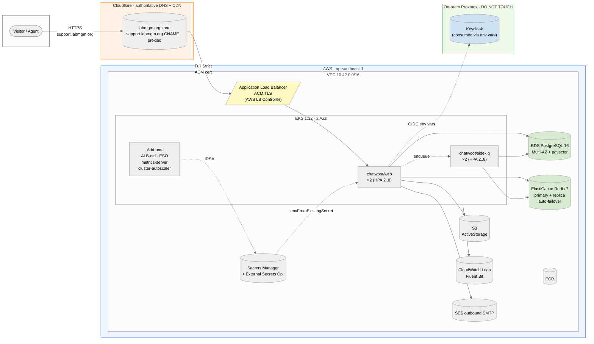
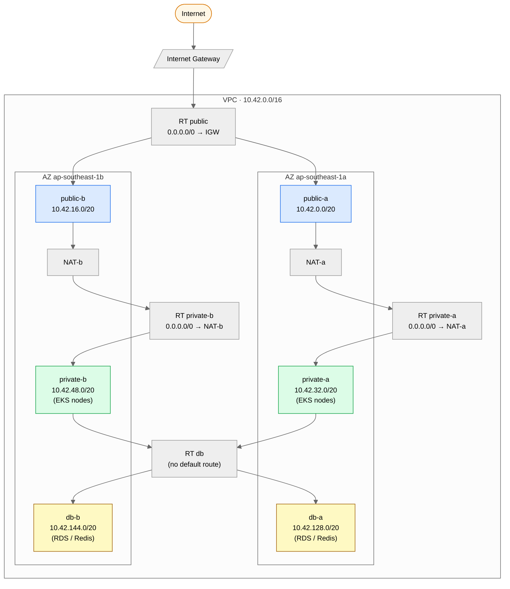
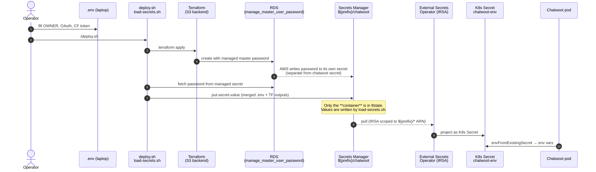
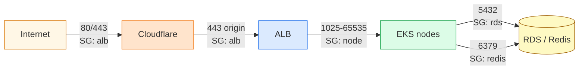
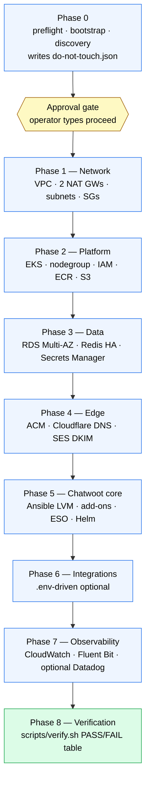
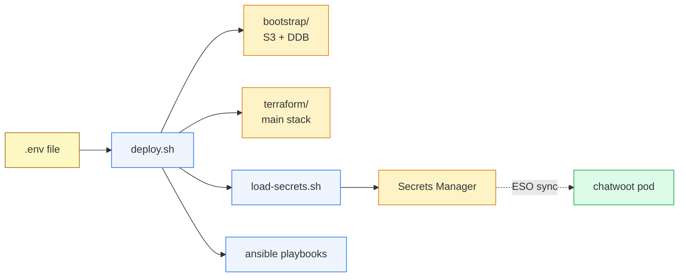
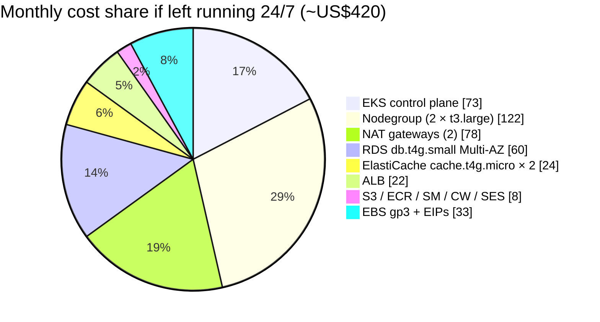
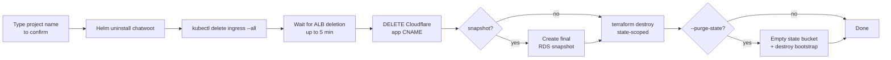

<div align="center">

# Chatwoot-TA

### High-availability Chatwoot on AWS — one command, fully reproducible

<p>
  <em>Terraform + Ansible. Multi-AZ EKS, Multi-AZ RDS, Redis HA, Cloudflare edge,<br/>
  ACM TLS, AWS Secrets Manager + External Secrets Operator, SES outbound.</em>
</p>

<p>
  
  
  
  
  
  
  
  
  
</p>

<p>
  <a href="#-quick-start">Quick start</a> ·
  <a href="#%EF%B8%8F-architecture">Architecture</a> ·
  <a href="#-high-availability">HA model</a> ·
  <a href="#-phases--gates">Phases</a> ·
  <a href="#-cost">Cost</a> ·
  <a href="#-teardown">Teardown</a> ·
  <a href="#-troubleshooting">Troubleshooting</a>
</p>

</div>

---

## ✨ What this is

A **single-command, idempotent IaC deployment** of [Chatwoot Community](https://www.chatwoot.com/) on AWS, designed for the **TA / final-project rubric** and engineered as if it were production. Run `./deploy.sh` from your laptop; run `./destroy.sh` when you're done. Re-running either is safe.

> [!IMPORTANT]
> **Shared-account safe.** This repo is built for an AWS account that already contains other infrastructure. Phase 0 runs a **read-only discovery** of every existing VPC, EKS cluster, and Route 53 zone, writes them to `terraform/discovery/do-not-touch.json`, and refuses to proceed if any candidate CIDR or name collides. State is isolated to a project-scoped S3 backend, so `terraform destroy` can only ever remove resources this stack created.

<details>
<summary><b>Rubric coverage at a glance</b></summary>

| Rubric item             | How it's satisfied                                                                              |
|-------------------------|-------------------------------------------------------------------------------------------------|
| **LVM**                 | Ansible-over-SSM turns a dedicated secondary EBS volume into `vg_data/lv_data → /data` on every worker, persisted in `/etc/fstab`. |
| **Manajemen User**      | Terraform-managed IAM users, groups, policies + IRSA roles per workload.                        |
| **Web server**          | Chatwoot Rails/Puma web pods over HTTPS via the ALB (L7) ingress.                              |
| **Virtualisasi**        | On-prem **Proxmox** (Keycloak host, referenced and untouched) + AWS EC2 (Nitro/KVM).            |
| **Docker / Containers** | Chatwoot OCI images in ECR; pods orchestrated by EKS.                                           |
| **Kubernetes**          | Multi-AZ EKS with managed nodegroup, HPA, PDB, topology spread, ingress.                       |
| **IaC**                 | Terraform (AWS + Cloudflare) + Ansible (nodes + Helm + verify).                                |
| **High Availability**   | 2 AZs · 2 NAT GWs · ≥2 web + ≥2 sidekiq · RDS Multi-AZ · Redis primary+replica with auto-failover · cluster-autoscaler. |

</details>

---

## 📋 Table of contents

- [🏗️ Architecture](#%EF%B8%8F-architecture)
- [🌐 Network topology](#-network-topology)
- [🛡️ High availability](#%EF%B8%8F-high-availability)
- [🔐 Security model](#-security-model)
- [📦 Phases & gates](#-phases--gates)
- [🛠️ Tech stack](#%EF%B8%8F-tech-stack)
- [🚀 Quick start](#-quick-start)
- [⚙️ Configuration](#%EF%B8%8F-configuration)
- [💰 Cost](#-cost)
- [🧪 Verification](#-verification)
- [🧹 Teardown](#-teardown)
- [🗂️ Repository layout](#%EF%B8%8F-repository-layout)
- [⚠️ Caveats](#%EF%B8%8F-caveats)
- [🐛 Troubleshooting](#-troubleshooting)

---

## 🏗️ Architecture

The deployed system spans Cloudflare's edge, an AWS VPC across two AZs, and one untouched on-prem Proxmox node (the Keycloak host you reach via env vars only).



<details>
<summary><b>Same diagram as PlantUML (higher fidelity export)</b></summary>

Source: [`docs/diagrams/architecture.puml`](docs/diagrams/architecture.puml). Render locally with `plantuml -tsvg docs/diagrams/architecture.puml`.

</details>

### Component breakdown

| Layer              | Component                            | Why it's there                                                                                |
|--------------------|--------------------------------------|-----------------------------------------------------------------------------------------------|
| **Edge / TLS**     | Cloudflare DNS + CDN (proxied)       | Authoritative for `labmgm.org`; CDN cache; DDoS shield; Full (Strict) to origin               |
| **Edge / TLS**     | ACM public cert                      | DNS-validated through Cloudflare; terminated on ALB                                           |
| **Ingress**        | AWS Load Balancer Controller → ALB   | L7 routing, health checks, TLS termination                                                    |
| **Compute**        | EKS 1.32 (control plane)             | Managed Kubernetes API + etcd                                                                 |
| **Compute**        | Managed nodegroup (AL2023, t3.large) | Custom launch template with secondary EBS for LVM; SSM-enabled (no SSH)                       |
| **Compute**        | cluster-autoscaler                   | Scales the nodegroup 2 → 4 on demand                                                          |
| **Data**           | RDS PostgreSQL 16 Multi-AZ           | App database; `vector` extension preloaded for pgvector                                       |
| **Data**           | ElastiCache Redis 7                  | Sidekiq queues + cache; primary + replica with automatic failover                             |
| **Storage**        | S3 (ActiveStorage)                   | File attachments, exports — accessed via IRSA, no static keys                                  |
| **Registry**       | ECR                                  | Mirror of `chatwoot/chatwoot` images                                                          |
| **Secrets**        | AWS Secrets Manager + ESO            | App secrets sourced from `.env` + TF outputs at deploy time, **never** in tfstate as plaintext |
| **Identity**       | IAM users/groups/policies + IRSA     | Manajemen User + per-workload least-privilege via OIDC                                        |
| **Email**          | Amazon SES outbound + DKIM           | App mail (verify, notifications); domain identity verified via Cloudflare DNS                 |
| **Observability**  | CloudWatch + Fluent Bit              | Cluster + pod + system logs; optional Datadog cluster agent if `DATADOG_API_KEY` set          |

---

## 🌐 Network topology

Two AZs, each with **public** / **private** / **db** subnets, and **its own NAT gateway** so an AZ failure can't take down egress for the surviving side.



### Subnet plan

Computed from the auto-selected `/16` (default `10.42.0.0/16`, shifted to the next free range if it collides):

| Tier        | AZ-1a CIDR        | AZ-1b CIDR         | Hosts                                  | Default route       |
|-------------|-------------------|--------------------|----------------------------------------|---------------------|
| **public**  | `10.42.0.0/20`    | `10.42.16.0/20`    | NAT GWs, ALB targets, future bastions  | IGW                 |
| **private** | `10.42.32.0/20`   | `10.42.48.0/20`    | EKS workers (pods)                     | per-AZ NAT          |
| **db**      | `10.42.128.0/20`  | `10.42.144.0/20`   | RDS, ElastiCache                       | _none_ (no egress)  |

> [!TIP]
> The 4096-IP gap between `/20` 4 and `/20` 8 is intentional headroom — Phase 0 can carve future tiers (e.g. cache, MSK) without renumbering.

---

## 🛡️ High availability

```mermaid
flowchart TD
    F[("Failure")]:::bad
    F --> A1[AZ-1a outage] --> R1[Web + sidekiq replicas in AZ-1b<br/>continue; topology-spread<br/>guarantees ≥1 per AZ]:::ok
    F --> A2[NAT-a fails] --> R2[Private AZ-1b egress unaffected<br/>NAT-b remains up]:::ok
    F --> A3[EKS node dies] --> R3[cluster-autoscaler launches<br/>replacement in same AZ;<br/>HPA holds capacity in the meantime]:::ok
    F --> A4[RDS primary fails] --> R4[Multi-AZ promotes standby<br/>~60-120s; sidekiq retries idempotent jobs]:::ok
    F --> A5[Redis primary fails] --> R5[Automatic failover promotes<br/>replica ~60s]:::ok
    F --> A6[Pod crashes] --> R6[K8s restarts container<br/>PDB ensures ≥1 always Ready]:::ok
    F --> A7[Cloudflare PoP outage] --> R7[Anycast fails over to nearest PoP<br/>(transparent to client)]:::ok

    classDef bad fill:#fee2e2,stroke:#dc2626
    classDef ok fill:#dcfce7,stroke:#16a34a
```

### Replicas, spread, and budgets

| Workload      | Replicas      | HPA                                    | PDB              | Topology spread                             |
|---------------|---------------|----------------------------------------|------------------|---------------------------------------------|
| `chatwoot/web`   | 2 (min) → 8 (max) | CPU 70%                            | `minAvailable: 1` | `topology.kubernetes.io/zone`, `maxSkew: 1` |
| `chatwoot/sidekiq` | 2 (min) → 8 (max) | CPU 70%                          | `minAvailable: 1` | `topology.kubernetes.io/zone`, `maxSkew: 1` |
| Nodegroup     | min 2, desired 2, max 4 | cluster-autoscaler            | n/a              | spread across both private subnets          |
| RDS           | Multi-AZ              | n/a                                | n/a              | primary + standby, automatic failover       |
| Redis         | primary + 1 replica   | n/a                                | n/a              | `multi_az_enabled = true`, `automatic_failover_enabled = true` |

---

## 🔐 Security model

### Secrets pipeline — values never touch Terraform state



### Trust boundaries



### IAM at a glance

| Principal                      | Type                | Permissions                                              |
|--------------------------------|---------------------|----------------------------------------------------------|
| `${prefix}-eks-cluster`        | EKS service role    | `AmazonEKSClusterPolicy`, `AmazonEKSVPCResourceController` |
| `${prefix}-eks-node`           | Node instance role  | Worker + CNI + ECR-pull + **SSM** + CloudWatch agent     |
| `${prefix}-irsa-alb-controller`     | IRSA            | AWS LB Controller upstream policy (v2.8.2)              |
| `${prefix}-irsa-cluster-autoscaler` | IRSA            | ASG describe + set-desired-capacity (tag-scoped)         |
| `${prefix}-irsa-external-secrets`   | IRSA            | `secretsmanager:GetSecretValue` on `${prefix}/*` only    |
| `${prefix}-irsa-chatwoot`           | IRSA            | S3 R/W on the ActiveStorage bucket only                  |
| `${prefix}-operators` group         | IAM group       | Read-only EKS / S3 / ECR / CloudWatch                    |
| `${prefix}-developers` group        | IAM group       | ECR push + EKS describe                                  |
| `${prefix}-gha`                     | GitHub OIDC     | `ReadOnlyAccess` for CI plan workflow                    |

> [!NOTE]
> The Chatwoot pod's IRSA role is scoped to **only its S3 bucket**. RDS master password is created and rotated by AWS RDS itself (`manage_master_user_password = true`); Terraform never sees the value. Redis auth token is the one secret value that lands in tfstate by necessity — the state bucket is versioned + encrypted + TLS-only as a defence in depth.

---

## 📦 Phases & gates

`deploy.sh` runs nine phases. Phase 0 is the only human checkpoint; after `proceed`, the rest runs unattended.



### Per-phase gate

| Phase | What runs                                                     | Gate (must be green to proceed)                                                                       |
|------:|---------------------------------------------------------------|-------------------------------------------------------------------------------------------------------|
| 0     | Preflight, bootstrap state, discovery                         | Tools, AWS+CF auth, quotas, no CIDR/name collisions; **operator approval**                            |
| 1     | VPC, IGW, 2 NAT, subnets, SGs                                 | 2 subnets per tier; 2 NAT GWs `available`; no pre-existing VPC modified                              |
| 2     | EKS, OIDC, custom LT (LVM-ready EBS), nodegroup, IAM, ECR, S3 | Cluster ACTIVE; ≥2 nodes Ready; secondary unformatted disk visible via SSM                            |
| 3     | RDS Multi-AZ + pgvector, Redis HA, Secrets Manager            | RDS `available` + Multi-AZ; Redis `available` + auto-failover + ≥2 nodes; secret container exists      |
| 4     | ACM cert, Cloudflare validation/DKIM/SPF/DMARC, SES SMTP user | ACM `ISSUED`; SES domain DKIM verified                                                                |
| 5     | Ansible: LVM via SSM, add-ons, ESO, Chatwoot Helm, CF CNAME   | `/data` on every node; ExternalSecret synced; ≥2 web + ≥2 sidekiq Ready; ingress has ALB hostname     |
| 6     | Integration status print (already wired via ESO)              | Active env keys listed; absent integrations cleanly disabled                                          |
| 7     | Fluent Bit DaemonSet + optional Datadog                       | App log group exists; agents healthy (if enabled)                                                     |
| 8     | `scripts/verify.sh` end-to-end acceptance                     | Every line in the [Acceptance checklist](#-verification) is PASS                                      |

---

## 🛠️ Tech stack

<table>
<tr>
<td valign="top">

**Infrastructure**

- Terraform ≥ 1.6
- AWS Provider 5.x
- Cloudflare Provider 4.x
- Ansible ≥ 2.15
- `community.aws.aws_ssm` connection plugin

</td>
<td valign="top">

**AWS**

- EKS 1.32 + OIDC
- RDS PostgreSQL 16 (Multi-AZ) + pgvector
- ElastiCache Redis 7 (primary + replica)
- S3 · ECR · Secrets Manager · ACM · SES · CloudWatch

</td>
<td valign="top">

**Kubernetes**

- AWS Load Balancer Controller
- cluster-autoscaler
- metrics-server
- External Secrets Operator
- Fluent Bit (aws-for-fluent-bit)
- HPA · PDB · topology spread

</td>
</tr>
<tr>
<td valign="top">

**Application**

- Chatwoot Community (Helm chart `chatwoot/chatwoot`)
- Rails 7 / Puma (web)
- Sidekiq

</td>
<td valign="top">

**Edge**

- Cloudflare DNS + CDN (proxied)
- ACM TLS at the ALB
- SSL mode: Full (Strict)

</td>
<td valign="top">

**CI/CD**

- GitHub Actions
- OIDC → IAM role
- `terraform-plan` on PRs
- `terraform-apply` gated (Environment + approval)
- `ansible-lint` + `yamllint`

</td>
</tr>
</table>

---

## 🚀 Quick start

### Prerequisites

> [!IMPORTANT]
> All of these must be on your `$PATH` before running `./deploy.sh`. Preflight will fail clearly if anything is missing.

| Tool                       | Minimum  | Install (macOS)                                                                |
|----------------------------|----------|--------------------------------------------------------------------------------|
| `terraform`                | 1.6      | `brew install terraform`                                                       |
| `ansible`                  | 2.15     | `brew install ansible`                                                         |
| `kubectl`                  | 1.28     | `brew install kubectl`                                                         |
| `helm`                     | 3.13     | `brew install helm`                                                            |
| `aws` CLI                  | 2.13     | `brew install awscli`                                                          |
| `jq`                       | 1.6      | `brew install jq`                                                              |
| `session-manager-plugin`   | any      | [AWS install guide](https://docs.aws.amazon.com/systems-manager/latest/userguide/session-manager-working-with-install-plugin.html) |

You also need:

- An **AWS profile** with admin-equivalent access in `ap-southeast-1`.
- A **Cloudflare API token** scoped to `labmgm.org` with `Zone.Zone:Read` + `Zone.DNS:Edit`.

### Three commands

```bash
git clone <this-repo> chatwoot-ta && cd chatwoot-ta
cp .env.example .env             # fill OWNER + CLOUDFLARE_API_TOKEN + GITHUB_OWNER/REPO
./deploy.sh                       # preflight → bootstrap → discovery → approval → end-to-end
```

After `./deploy.sh` finishes, open [`https://support.labmgm.org`](https://support.labmgm.org) and check the verification table printed at the end.

<details>
<summary><b>What deploy.sh actually does, in order</b></summary>

1. **Preflight** — tool versions, `.env` keys, AWS STS, Cloudflare token, Service Quotas.
2. **Bootstrap** — local-state TF creates a versioned, encrypted S3 bucket and a DynamoDB lock table.
3. **`terraform init`** — main stack against the S3 backend just created.
4. **Phase 0** — discovery + plan (no billable resources yet) + **approval gate**.
5. **`terraform apply`** — Phases 1–4 (network, platform, data, edge).
6. **`load-secrets.sh`** — `.env` + TF outputs → Secrets Manager (values bypass tfstate).
7. **`aws eks update-kubeconfig`** — point `kubectl` at the new cluster.
8. **Ansible** — `00-nodes-lvm` → `10-cluster-addons` → `20-secrets` → `30-chatwoot` → `40-observability`.
9. **`verify.sh`** — prints the acceptance table; non-zero exit on any FAIL.

</details>

---

## ⚙️ Configuration

Every knob lives in `.env`. Blank values **disable** the corresponding feature.



### Minimum required keys

| Key                    | What it is                                                            |
|------------------------|-----------------------------------------------------------------------|
| `OWNER`                | Your name/handle (resource tag)                                       |
| `AWS_REGION`           | `ap-southeast-1` (don't change)                                       |
| `NAME_PREFIX`          | Short lowercase prefix (default `cwta`)                               |
| `DOMAIN`               | Public FQDN (`support.labmgm.org`)                                    |
| `FRONTEND_URL`         | `https://support.labmgm.org`                                          |
| `CLOUDFLARE_API_TOKEN` | Scoped token for the `labmgm.org` zone                                 |
| `CLOUDFLARE_ZONE`      | `labmgm.org`                                                          |
| `GITHUB_OWNER` / `GITHUB_REPO` | Used to scope the GHA OIDC IAM role                          |

<details>
<summary><b>All optional integrations (blank = OFF)</b></summary>

| Category          | Keys                                                                 |
|-------------------|----------------------------------------------------------------------|
| **Errors / APM**  | `SENTRY_DSN`, `DATADOG_API_KEY`, `DATADOG_SITE`, `SCOUT_KEY`         |
| **GeoIP**         | `MAXMIND_LICENSE_KEY` (free GeoLite2)                                 |
| **Rate limiting** | `ENABLE_RACK_ATTACK`                                                  |
| **Billing**       | `STRIPE_SECRET_KEY`                                                   |
| **AI**            | `OPENAI_API_KEY`                                                      |
| **OAuth**         | `GOOGLE_OAUTH_CLIENT_ID/SECRET`, `AZURE_APP_ID/SECRET/TENANT_ID`     |
| **OIDC**          | `KEYCLOAK_OIDC_ISSUER/CLIENT_ID/CLIENT_SECRET`                       |
| **Web push**      | `VAPID_PUBLIC_KEY`, `VAPID_PRIVATE_KEY` (auto-generated if blank)    |
| **Mobile push**   | `FCM_SERVER_KEY`, `APNS_KEY_ID`, `APNS_TEAM_ID`, `APNS_AUTH_KEY`     |

</details>

> [!NOTE]
> Social channels (Facebook, Instagram, Twitter/X, Slack) are **intentionally disabled** by request — env keys are present but blank.

---

## 💰 Cost

The intended lifecycle is **deploy → demo → destroy**. The pricing reflects that:



| Mode                       | Rough cost           | Notes                                                                    |
|----------------------------|----------------------|--------------------------------------------------------------------------|
| Running (per hour)         | ~US$0.60 – US$0.90   | EKS + nodes + NAT + RDS + Redis + ALB                                    |
| 5-hour demo                | ~US$4 – US$6         | The pattern this repo is built for                                       |
| Left on 24 × 7             | ~US$350 – US$500/mo  | Inside the US$750/mo budget; well above the deploy-when-needed pattern   |

> [!TIP]
> A single destroy snapshots RDS by default — `./destroy.sh` is cheap, fast, and safe.

---

## 🧪 Verification

`scripts/verify.sh` runs at the end of `deploy.sh` and prints a PASS/FAIL table.

<details>
<summary><b>Acceptance checklist (all must be green)</b></summary>

- `terraform plan` shows **0 changes** (no drift).
- EKS cluster `ACTIVE`; `kubectl get nodes` ≥ 2 `Ready`.
- Every worker: `/data` mounted on LVM (`vg_data/lv_data`); persists in `/etc/fstab`.
- RDS `available` + **Multi-AZ**; pgvector available.
- ElastiCache `available`, 2 nodes, auto-failover on.
- S3, ECR, Secrets Manager, CloudWatch log group exist.
- ACM cert `ISSUED`; Cloudflare proxied record resolves; SSL Full (Strict).
- Add-ons Running: ALB controller, cluster-autoscaler, metrics-server, ESO.
- `ExternalSecret chatwoot-env` `Ready=True`.
- Chatwoot: ≥ 2 web Ready, ≥ 2 sidekiq Ready; HPA + PDB present.
- Ingress has ALB hostname; `curl -I https://support.labmgm.org` → 200/301/302.
- SES domain DKIM verified.
- IAM groups + IRSA roles exist (Manajemen User evidence).
- New VPC ID does NOT match any pre-existing VPC in `do-not-touch.json`.

</details>

---

## 🧹 Teardown

```bash
./destroy.sh                  # drains ingresses, removes CF record, snapshots RDS, terraform destroy
./destroy.sh --purge-state    # also removes the bootstrap state bucket + lock table
./destroy.sh --skip-snapshot  # skip the final RDS snapshot (NOT recommended)
```

> [!CAUTION]
> A destroy removes RDS and ElastiCache, so **app data does not persist across teardowns**. `destroy.sh` takes a final RDS snapshot by default; restore from it on the next deploy if you need the data back.

Order of teardown (so the controller-managed ALB doesn't deadlock the VPC destroy):



---

## 🗂️ Repository layout

```text
chatwoot-ta/
├── deploy.sh                       # entrypoint — Phases 0..8 end-to-end
├── destroy.sh                      # safe, state-scoped teardown
├── README.md                       # this file
├── .env.example                    # every key commented; empty = feature off
├── .gitignore
│
├── bootstrap/                      # local-state TF → S3 state bucket + DDB lock
│   ├── main.tf · outputs.tf · variables.tf · versions.tf
│
├── terraform/                      # main stack (S3-backed)
│   ├── versions.tf · providers.tf · backend.tf
│   ├── variables.tf · outputs.tf
│   ├── 00-discovery.tf             # read-only inventory + non-overlap CIDR picker
│   ├── 10-network.tf               # VPC, subnets, 2 NAT, routes, SGs
│   ├── 20-iam.tf                   # users/groups/IRSA roles
│   ├── 30-eks.tf                   # cluster + OIDC + LT + nodegroup
│   ├── 40-ecr.tf                   # registry
│   ├── 50-s3.tf                    # ActiveStorage bucket
│   ├── 60-rds.tf                   # PG16 Multi-AZ + pgvector
│   ├── 70-elasticache.tf           # Redis primary + replica
│   ├── 80-secrets.tf               # Secrets Manager container
│   ├── 90-cloudwatch.tf            # app log group
│   ├── 95-cloudflare.tf            # ACM validation + DKIM/SPF/DMARC
│   ├── 96-acm.tf · 97-ses.tf
│   └── 98-github-oidc.tf           # GHA OIDC role
│
├── ansible/
│   ├── ansible.cfg · requirements.yml
│   ├── inventory/aws_ec2.yml       # dynamic; SSM connection
│   ├── vars/main.yml
│   ├── templates/
│   │   ├── chatwoot-values.yaml.j2 # rendered Helm values
│   │   └── external-secret.yaml.j2 # ClusterSecretStore + ExternalSecret
│   └── playbooks/
│       ├── 00-nodes-lvm.yml        # LVM on workers via SSM
│       ├── 10-cluster-addons.yml   # ALB ctrl · CA · metrics-server · ESO
│       ├── 20-secrets.yml          # wire ESO → chatwoot-env
│       ├── 30-chatwoot.yml         # Helm install + CF CNAME → ALB
│       ├── 40-observability.yml    # Fluent Bit + optional Datadog
│       └── 99-verify.yml           # parallel verification path
│
├── scripts/
│   ├── preflight.sh                # tools + auth + quotas
│   ├── load-secrets.sh             # .env + TF outputs → Secrets Manager
│   └── verify.sh                   # end-to-end acceptance table
│
├── docs/diagrams/                  # PlantUML sources for architecture docs
│   ├── architecture.puml
│   ├── network-topology.puml
│   ├── secrets-flow.puml
│   ├── phases.puml
│   └── ha-model.puml
│
└── .github/workflows/
    ├── terraform-plan.yml          # PR plan with OIDC role; posts comment
    ├── terraform-apply.yml         # workflow_dispatch + Environment approval
    └── ansible-lint.yml
```

---

## ⚠️ Caveats

> [!WARNING]
> Read these before showing the demo or planning a long-running deployment.

<details open>
<summary><b>SES sandbox</b></summary>

New AWS accounts land in the SES sandbox: outbound mail only works to **verified** addresses. That's fine for the "infra up" gate and demos to a couple of verified inboxes. Production sending requires a separate sandbox-removal request to AWS (a few hours to a day).

</details>

<details>
<summary><b>Keycloak / OIDC on Chatwoot Community</b></summary>

Chatwoot Community has **limited** native SSO. We wire the OIDC env vars the OSS edition supports; full SSO / SCIM provisioning is an Enterprise feature. Treat OIDC as best-effort and document the limitation rather than promising seamless SSO.

</details>

<details>
<summary><b>Redis auth token in tfstate</b></summary>

ElastiCache requires the AUTH token at create time, so the token lives in Terraform state (encrypted at rest in S3). RDS uses `manage_master_user_password = true` to avoid this; ElastiCache has no equivalent. The state bucket has versioning, AES-256 SSE, and a TLS-only bucket policy as defence in depth.

</details>

<details>
<summary><b>App data does not survive a destroy</b></summary>

`./destroy.sh` removes RDS + ElastiCache. The default flow takes a final RDS snapshot so you can restore on the next deploy. ElastiCache contents are queue/cache only — losing them is harmless after a graceful drain.

</details>

<details>
<summary><b>MaxMind GeoIP</b></summary>

The app reads `MAXMIND_LICENSE_KEY` for the GeoLite2 database. Sign up for a free MaxMind account, generate a key, paste it into `.env`. If absent, GeoIP features are silently disabled.

</details>

<details>
<summary><b>Social channels (FB / IG / X / Slack)</b></summary>

Disabled by request — env keys are present in `.env.example` but blank. Populate them later if needed.

</details>

---

## 🐛 Troubleshooting

<details>
<summary><b>Preflight fails on Cloudflare token</b></summary>

The token needs **both** `Zone.Zone:Read` and `Zone.DNS:Edit` scoped to `labmgm.org`. The zone-list endpoint must return that zone — preflight verifies this explicitly.

</details>

<details>
<summary><b>No non-overlapping CIDR available</b></summary>

Phase 0 considers `10.42.0.0/16 → 10.46.0.0/16`. If all five collide with existing VPCs, either (a) extend `var.vpc_cidr_candidates` in `terraform/variables.tf`, or (b) set `VPC_CIDR=10.50.0.0/16` (or similar) in `.env` to pin a specific block.

</details>

<details>
<summary><b>Phase 5 LVM playbook can't find the secondary disk</b></summary>

The playbook locates the disk by size (`NODE_DATA_VOLUME_GB`, default 10). If you changed the launch template default, set the env var to match. The fallback path uses `lsblk -bndo NAME,SIZE,FSTYPE,MOUNTPOINT` and picks the first ~10 GB device with no FS / no mount.

</details>

<details>
<summary><b>ALB never gets a hostname</b></summary>

Most common cause: the ALB Controller has insufficient permissions. Phase 5 installs it with the IRSA role created in Phase 2. Check:

```bash
kubectl -n kube-system logs deploy/aws-load-balancer-controller
```

If the controller log says `subnets ... did not have the required tag`, re-run `terraform apply` — Phase 1 sets `kubernetes.io/role/elb` (public) and `kubernetes.io/role/internal-elb` (private) automatically.

</details>

<details>
<summary><b>destroy.sh hangs on VPC</b></summary>

This almost always means a lingering controller-managed resource (ALB, security group attachment). `destroy.sh` already drains ingresses before touching Terraform, but if something else attached an ENI to the VPC, find it with:

```bash
aws ec2 describe-network-interfaces --filters Name=vpc-id,Values=<vpc-id> \
  --query 'NetworkInterfaces[].[Description,Status]' --output table
```

</details>

<details>
<summary><b>"plan shows changes" after a clean apply</b></summary>

The two known sources we explicitly guarded against:

1. `local_file` in `00-discovery.tf` used to include a `timestamp()` (fixed — would churn on every plan).
2. `aws_db_instance.master_user_secret_kms_key_id` is ignored in `lifecycle.ignore_changes` (AWS may rotate the KMS key during managed-password rotation).

If you see drift elsewhere, file an issue — we want `plan = 0` to be a hard invariant.

</details>

---

<div align="center">

**Built with Terraform · Ansible · EKS · RDS · Cloudflare · Chatwoot OSS**

<sub>Architecture docs: <a href="docs/diagrams/">docs/diagrams/</a> · Issue? Open one with the output of <code>./scripts/verify.sh</code>.</sub>

</div>
